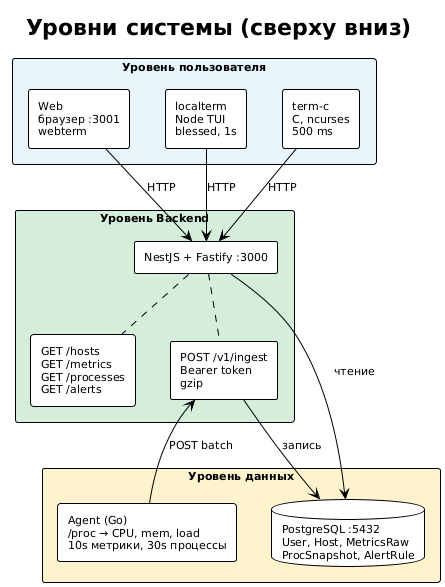
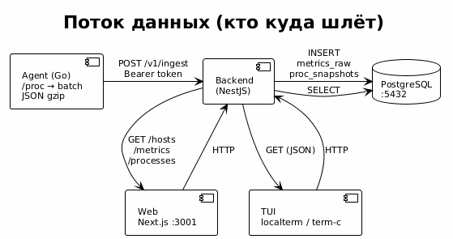
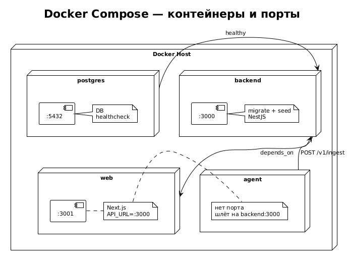
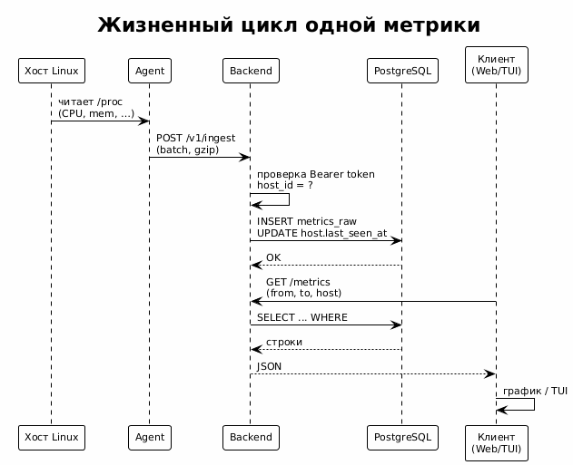
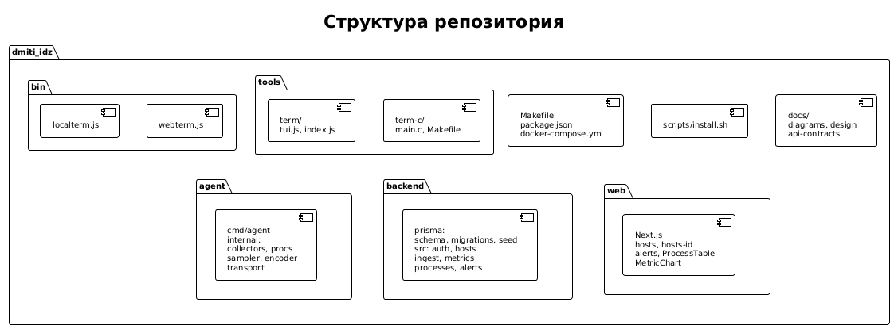

# Monitoring Stack

Система мониторинга OS-метрик: агент на Go собирает данные с хостов, бэкенд (NestJS) принимает и хранит в PostgreSQL, веб (Next.js) и терминальные клиенты отображают хосты, графики, процессы и алерты.

---

## Содержание

1. [Архитектура и как это работает](#архитектура-и-как-это-работает)
2. [Установка и команды](#установка-и-команды)
3. [Компоненты системы](#компоненты-системы)
4. [API и данные](#api-и-данные)
5. [Структура проекта](#структура-проекта)
6. [Что сделано](#что-сделано)
7. [Что предстоит сделать](#что-предстоит-сделать)

---

## Архитектура и как это работает

Диаграммы сгенерированы из [PlantUML](https://plantuml.com/). Исходники: `docs/diagrams/*.puml`. Пересоздать картинки: **`make diagrams`** (нужен Docker и образ `plantuml/plantuml`).

### Схема 1. Уровни системы (сверху вниз)



### Схема 2. Поток данных (кто куда шлёт)



### Схема 3. Docker: контейнеры и порты



### Схема 4. Жизненный цикл одной метрики



### Поток данных (таблица)

| Этап | Кто | Что делает |
|------|-----|------------|
| 1 | **Agent** | Раз в 10 с читает CPU, память, load, сеть, диск из `/proc`; раз в 30 с — топ процессов. Собирает batch (JSON), сжимает gzip, шлёт `POST /v1/ingest` с заголовком `Authorization: Bearer <host_token>`. |
| 2 | **Backend** | По токену находит хост (SHA256 токена = `token_hash` в БД). Проверяет `host_id` в теле. Пишет метрики в `metrics_raw`, снимки процессов в `proc_snapshots`, обновляет `host.last_seen_at`. |
| 3 | **БД** | Хранит хосты, историю метрик, снимки процессов, правила алертов и события. Всё переживает перезапуск. |
| 4 | **Web / TUI** | Запрашивают `GET /hosts`, `GET /metrics`, `GET /processes` и т.д. Строят графики (Recharts), таблицы процессов (сортировка, фильтр), список алертов. |

### Зачем база данных

В PostgreSQL хранятся: **хосты** (идентификация по токену), **история метрик** (графики за часы/дни), **снимки процессов**, **правила алертов** и **события**. Без БД после рестарта бэкенда всё теряется; с БД — данные сохраняются.

---

## Установка и команды

### Быстрый старт

```bash
make install    # зависимости backend, web, tools/term + npm link
```

После этого в PATH доступны **`localterm`** и **`webterm`**.

### Таблица команд

| Команда | Действие |
|--------|----------|
| **`localterm`** | Терминальный TUI: баннер с ссылками и подсказками, затем htop-like (обновление 1 с). **Должен быть поднят backend:** `make up`. |
| **`webterm`** | Поднимает Docker (postgres + backend + web + agent), показывает баннер, через 3 с открывает в браузере http://localhost:3001. |
| **`make up`** | Запустить весь стек в Docker (postgres, backend, web, agent). |
| **`make down`** | Остановить контейнеры. |
| **`make term`** | То же, что `localterm`, из корня репо. |
| **`make term-c`** | Собрать и запустить быстрый TUI на C (ncurses + libcurl), обновление 500 мс. |
| **`make logs`** | Логи docker compose. |
| **`make clean`** | Удалить node_modules и сборку term-c. |
| **`make help`** | Список целей. |

### Ссылки после запуска

| Сервис | URL |
|--------|-----|
| Веб-интерфейс | http://localhost:3001 |
| Backend API | http://localhost:3000 |
| Swagger (документация API) | http://localhost:3000/api/docs |

---

## Компоненты системы

| Компонент | Технологии | Назначение |
|-----------|------------|------------|
| **Agent** | Go | Сбор метрик (CPU, память, load, сеть, диск) и топ процессов с хоста. Отправка batch в backend по HTTP (gzip). Работает **только на Linux** (читает `/proc`). В Docker — Linux-контейнер. |
| **Backend** | NestJS, Fastify, Prisma | Приём `POST /v1/ingest`, идентификация хоста по токену, запись в БД. API: хосты, метрики, процессы, алерты и правила. Миграции и seed при старте (дефолтный хост + пользователь). |
| **Web** | Next.js 14+, shadcn/ui, TanStack Query, Recharts | Дашборд: список хостов, страница хоста с графиками и вкладкой «Процессы» (таблица с сортировкой и фильтром, автообновление 2 с), раздел «Алерты». Без входа по логину/паролю. |
| **Term (Node)** | Node.js, blessed | TUI в стиле htop: список процессов, сортировка (s/S), фильтр (f), смена хоста (h), обновление 1 с. Баннер при запуске `localterm`. |
| **Term (C)** | C, ncurses, libcurl | То же по смыслу, обновление 500 мс. Сборка: `make` в `tools/term-c` (нужны ncurses и libcurl). |
| **PostgreSQL** | Postgres 16 | Хранение пользователей, хостов, метрик, снимков процессов, правил и событий алертов. |

Зависимости контейнеров см. **Схему 3** выше (рисунок Docker).

---

## API и данные

### Основные методы API

| Метод | Путь | Описание |
|-------|------|----------|
| POST | `/v1/ingest` | Приём batch метрик и процессов от агента. Заголовок `Authorization: Bearer <host_token>`. |
| GET | `/hosts` | Список хостов (опционально `?online=true|false`). |
| GET | `/hosts/:id` | Один хост по id. |
| GET | `/metrics` | Метрики за период: `host`, `from`, `to`, `resolution=raw|1m|5m`. |
| GET | `/processes` | Снимки процессов: `host`, `from`, `to`, `limit`. |
| GET | `/alerts` | События алертов (фильтры: host, from, to, status). |
| GET/POST/PATCH/DELETE | `/alert-rules` | CRUD правил алертов. |

Подробно: **Swagger** — http://localhost:3000/api/docs.

### Модель данных (БД)

| Таблица | Назначение |
|---------|------------|
| **User** | Пользователи (email, password_hash, role). Сейчас вход отключён. |
| **Host** | Хосты: id, name, token_hash (SHA256 токена), os, arch, tags, last_seen_at. |
| **MetricsRaw** | Сырые метрики: ts, host_id, cpu_total_pct, load1/5/15, mem_used_mb, mem_total_mb, disk_used_pct, net_rx_bps, net_tx_bps. |
| **ProcSnapshot** | Снимок процессов: host_id, ts, pid, name, cpu_pct, rss_mb, io_read_bps, io_write_bps, state. |
| **AlertRule** | Правило: host_id (или глобальное), metric, op, threshold, window, severity, enabled. |
| **AlertEvent** | Событие срабатывания: host_id, rule_id, ts, status, message. |

---

## Структура проекта

### Схема 5. Структура репозитория



### Таблица путей

| Путь | Описание |
|------|----------|
| **Makefile**, **scripts/install.sh** | Установка зависимостей и `npm link` для команд `localterm` / `webterm`. |
| **bin/localterm.js**, **bin/webterm.js** | Обёртки: баннер + запуск TUI или Docker. |
| **package.json** (корень) | Имя пакета и bin для `localterm` / `webterm`. |
| **agent/** | Go-агент: config, collectors (cpu, mem, load, net, fs), procs, sampler, encoder (JSON+gzip), transport (HTTP), service. |
| **backend/** | NestJS: auth, hosts, ingest, metrics, processes, alerts, alert-rules, prisma, guards. Dockerfile + entrypoint (migrate, seed, node). |
| **web/** | Next.js: страницы hosts, hosts/[id] (метрики + процессы), alerts; компоненты MetricChart, DateRangePicker, ProcessTable; middleware /login → /hosts. |
| **tools/term/** | Node TUI (blessed): tui.js — htop-like; index.js — простой вывод. |
| **tools/term-c/** | C TUI: main.c (ncurses, libcurl, минимальный разбор JSON), Makefile. |
| **docs/** | design, api-contracts, data-model, roles, systemd, os-metrics. |
| **docker-compose.yml** | Сервисы: postgres, backend, web, agent. |

---

## Что сделано

| Область | Реализовано |
|---------|-------------|
| **Агент** | Сбор CPU, памяти, load, сети, диска, топ процессов; batch + gzip; отправка на backend с Bearer-токеном; конфиг (YAML); graceful shutdown. |
| **Backend** | Ingest по токену хоста; регистрация хоста по last_seen_at; API хостов, метрик, процессов; Prisma, миграции, seed (дефолтный хост + пользователь); алерты: модель, cron-проверка, CRUD правил и GET событий. |
| **Web** | Список хостов (online/offline), страница хоста с графиками (Recharts) и выбором периода; вкладка «Процессы» — таблица с сортировкой, фильтром, автообновлением 2 с; раздел «Алерты»; без логина. |
| **Терминал** | Node TUI (blessed): таблица процессов, сортировка, фильтр, смена хоста, обновление 1 с; C TUI (ncurses, curl) с обновлением 500 мс; баннеры при запуске localterm и webterm. |
| **Запуск** | Docker Compose (postgres, backend, web, agent); Makefile (install, up, down, term, term-c, clean); команды localterm и webterm через npm link. |
| **Документация** | README с архитектурой, таблицами, командами; docs (design, API, data model, roles и др.). |

---

## Что предстоит сделать

Ниже — список улучшений для «супер подробной и крутой» работы приложения.

### Надёжность и масштаб

| Задача | Описание |
|--------|----------|
| TimescaleDB и retention | Включить TimescaleDB (hypertable по `ts` для `metrics_raw`), настроить retention (например 30 дней raw, 90 дней 1m, 180 дней 5m/1h). |
| Агрегаты 1m/5m/1h | Continuous aggregates или отдельные таблицы для снижения нагрузки на запросах за длинные периоды. |
| Health checks | Health-эндпоинты backend и web в Docker (healthcheck), зависимость agent от health backend. |
| Повторы и backoff | В агенте — экспоненциальный backoff при ошибках ingest; лимиты на размер batch. |

### Безопасность и доступ

| Задача | Описание |
|--------|----------|
| Включить авторизацию (опционально) | Вернуть JWT для API (или флаг «с авторизацией»): логин, защита GET /hosts, /metrics и т.д. |
| HTTPS | Обратный прокси (nginx/traefik) с TLS для web и API в продакшене. |
| Ограничение по токену | Rate limit на ingest по host_token; проверка размера тела. |

### Функциональность

| Задача | Описание |
|--------|----------|
| Действия над процессами | API на backend (или через агент): kill/signal процесса по PID; кнопки в веб и TUI. |
| Больше метрик | Per-CPU, disk I/O, температура (если агент умеет); отображение в веб и TUI. |
| Дашборды и виджеты | Сохраняемые дашборды, выбор метрик и периодов по умолчанию. |
| Уведомления | Интеграция алертов: email, Slack, Telegram, webhook. |
| Поиск и фильтры | По хостам (по имени, тегам), по алертам (по правилу, хосту, дате). |

### Удобство и наблюдение

| Задача | Описание |
|--------|----------|
| Логи и трейсинг | Структурированные логи (JSON); опционально trace_id по цепочке agent → backend. |
| Метрики самого backend | Prometheus-эндпоинт или аналог (количество запросов, ошибок, латентность). |
| Тесты | E2E: агент → ingest → GET метрик; unit-тесты для ingest, алертов, API. |
| Деплой | Примеры systemd, ansible/terraform или docker-compose для прода; переменные окружения и секреты. |

### Документация

| Задача | Описание |
|--------|----------|
| Runbook | Что проверять при «пустой список хостов», при падении агента, при неработающих алертах. |
| API-примеры | curl-примеры в README или в docs для всех основных эндпоинтов. |

---

## Добавление нового хоста (агент на своей машине)

1. Создать хост в БД (например, с токеном `my-token` и именем `my-server`):

```bash
docker compose exec postgres psql -U postgres -d monitoring -c "INSERT INTO \"Host\" (id, name, token_hash, \"created_at\") VALUES (gen_random_uuid(), 'my-server', '$(echo -n my-token | sha256sum | awk '{print $1}')', NOW());"
```

2. Узнать `id` хоста: `SELECT id, name FROM "Host";`

3. На Linux-машине: собрать агент (`cd agent && go build -o monagent ./cmd/agent`), в конфиге указать `server_url`, `host_id`, `host_token`, запустить (systemd или вручную).

**Почему пусто?** Хосты появляются, когда хотя бы один агент начал слать метрики. При `make up` агент уже в контейнере и через 10–20 с хост «local» появляется в UI.

---

## Runbook и типичные ошибки

### Пустой список хостов

- **Причина:** Агент ещё не отправлял данные или не может достучаться до backend.
- **Проверить:** `docker compose ps` — контейнер agent в состоянии Up; `docker compose logs agent` — нет ли ошибок ingest (connection refused, 401, 413).
- **Решение:** Убедиться, что backend здоров: `curl -s http://localhost:3000/ready`. Подождать 10–30 с после старта; проверить `SERVER_URL` и `HOST_TOKEN` у агента (токен должен совпадать с записью в БД по `token_hash`).

### Пустой список процессов

- **Причина:** Агент шлёт процессы раз в ~30 с; за последние 2 минуты по хосту может не быть снимков.
- **Решение:** Подождать до 1 минуты; проверить, что хост online (зелёный индикатор). Если хост online, но процессов нет — посмотреть логи агента (ошибки сбора процессов).

### Пустые алерты / алерты не срабатывают

- **Проверить:** Есть ли правила: `GET /alert-rules`. Правило должно быть `enabled: true`, порог и метрика — осмысленные.
- **Решение:** Создать правило через веб (Alert rules) или `POST /alert-rules`; подождать окно срабатывания (cron проверяет периодически).

### Опциональная авторизация и логи

- **AUTH_ENABLED:** при `AUTH_ENABLED=true` все GET-запросы к `/hosts`, `/metrics`, `/processes`, `/alerts`, `/alert-rules` требуют JWT. Получить токен: `POST /auth/login` с `email` и `password` (пользователь из seed: demo@test.com / demo). Передавать заголовок `Authorization: Bearer <access_token>`.
- **LOG_JSON:** при `LOG_JSON=true` бэкенд пишет логи в формате JSON (level, time, msg, context) для парсинга в логагрегаторах.

### Ошибки ingest (413, 429)

- **413 Payload Too Large:** Backend ограничивает тело запроса (по умолчанию 1 MB). Агент при 413 уменьшает число процессов в batch и повторяет.
- **429 Too Many Requests:** Включён rate limit по host_token. Увеличить лимит (`INGEST_RATE_LIMIT_MAX`, `INGEST_RATE_LIMIT_WINDOW_MS`) или отключить: `INGEST_RATE_LIMIT_DISABLED=1`.

### Агент на своей машине

- Собрать: `cd agent && go build -o monagent ./cmd/agent`.
- Конфиг YAML: `server_url`, `host_id`, `host_token` (обязательно). Опционально: `command_listen_addr` (по умолчанию `:9090`) и `command_secret` (или `AGENT_COMMAND_SECRET`) для приёма команд kill/signal.
- В БД у хоста задать `agent_url` (например `http://IP_машины:9090`), чтобы с веб/TUI можно было отправлять сигналы процессам.

---

## Примеры API (curl)

Базовый URL: `http://localhost:3000` (или ваш backend).

```bash
# Health
curl -s http://localhost:3000/health
curl -s http://localhost:3000/ready

# Хосты
curl -s http://localhost:3000/hosts
curl -s "http://localhost:3000/hosts?online=true"

# Метрики за последний час
FROM=$(date -u -v-1H +%Y-%m-%dT%H:%M:%S.000Z 2>/dev/null || date -u -d '1 hour ago' +%Y-%m-%dT%H:%M:%S.000Z)
TO=$(date -u +%Y-%m-%dT%H:%M:%S.000Z)
curl -s "http://localhost:3000/metrics?host=HOST_ID&from=$FROM&to=$TO&resolution=1m"

# Процессы
curl -s "http://localhost:3000/processes?host=HOST_ID&limit=50"

# Алерты (события)
curl -s "http://localhost:3000/alerts"
curl -s "http://localhost:3000/alerts?status=firing"

# Правила алертов
curl -s http://localhost:3000/alert-rules
curl -s "http://localhost:3000/alert-rules?host=HOST_ID"

# Отправить сигнал процессу (требуется agent_url у хоста и AGENT_COMMAND_SECRET)
curl -s -X POST "http://localhost:3000/hosts/HOST_ID/processes/PID/signal" \
  -H "Content-Type: application/json" \
  -d '{"signal":"SIGTERM"}'
```
